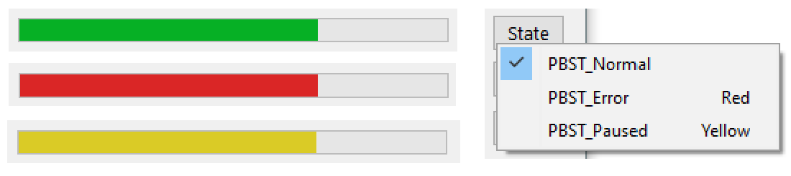
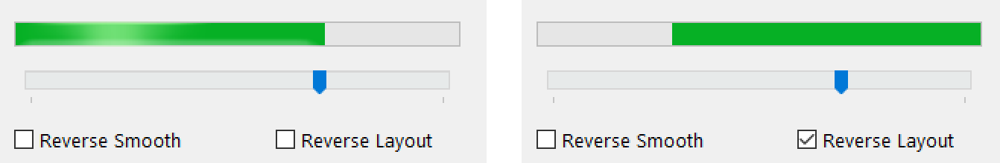

## Progress Bar API tricks including Marquee and State Color

A Clarion Progress Bar can have a few new features by making a few simple Windows API calls.
 This example wraps these calls in a Class to make them easier.

A Marquee Progress for when you don't know how long something will take.
 It shows a moving bar constantly, an animation of sorts.
 In my tests of a blocking loop the Marquee did NOT update so it seems to require windows messages to process.

When Visual Styles are used a Progress cannot have its color changed. 
 What can be done to change color is a State change to Error or Paused.
 You might do this when displaying a message to alter the use progress failed or paused.
 

You can reverse the Progress Bar to grow from Right to Left by setting PROP:Layout=1.
 Moving in Reverse can be improved by a feature called "Reverse Smooth" but this only
 affects large changes so is not really useful.

Below is a screen capture of the example project window showing the Marquee animation.

